# Cornwall Conservation Events

This is a simple web application that displays a list of conservation events in Cornwall. The events are stored in a database and can be added, edited, and deleted. Site users can also comment on events.

Live link: [Cornwall Conservation Events](https://cornwall-conservation-events.herokuapp.com/)

## Table of Contents

1. [UX Design](#ux-design)
   1. [Colour Scheme](#colour-scheme)
   2. [Typography](#typography)
   3. [Imagery](#imagery)
   4. [User Stories](#user-stories)
   5. [Wireframes](#wireframes)
   6. [ERD Diagram](#erd-diagram)
2. [Features](#features)
   1. [Existing Features](#existing-features)
   2. [Features Left to Implement](#features-left-to-implement)
3. [Technologies Used](#technologies-used)
   1. [How AI Was Used](#how-ai-was-used)
4. [Testing](#testing)
5. [Deployment](#deployment)
6. [Credits](#credits)
   1. [Content](#content)
   2. [Media](#media)
   3. [Acknowledgements](#acknowledgements)

## UX Design

### Colour Scheme

The colour scheme for the site is inspired by the natural beauty of Cornwall. The primary colours are green and blue, which are associated with nature and the sea. The secondary colours are white and grey, which provide contrast and readability.

### Typography

The site uses the Google Fonts "Inter" for the main text and "Lato" for the headings. These fonts were chosen for their readability and modern appearance.

### Imagery

The site uses images that are relevant to the events being displayed. These images are sourced from Cloudinary and are optimised for fast loading times.

### User Stories

1. As a site user, I can click on an event so that I can read the full text.

   **Acceptance criteria**

   - When an event post title is clicked on, a detailed view of the event is seen.

2. As a site user, I can view a paginated list of events so that I can select which event I want to view.

   **Acceptance criteria**

   - Given more than one event in the database, these multiple events are listed.
   - When a user opens the main page, a list of events is seen.
   - Then the user sees all event titles with pagination to choose what to read.

3. As a Site User / Admin, I can view comments on an individual post so that I can read the conversation.

   **Acceptance criteria**

   - Given one or more user comments, the admin can view them.
   - Then a site user can click on the comment thread to read the conversation.

4. As a site user, I can modify or delete my comment on a post so that I can be involved in the conversation.

   **Acceptance criteria**

   - Given a logged-in user, they can modify their comment.
   - Given a logged-in user, they can delete their comment.

5. As a site admin, I can approve or disapprove comments so that I can filter out objectionable comments.

   **Acceptance criteria**

   - Given a logged-in user, they can approve a comment.
   - Given a logged-in user, they can disapprove a comment.

6. As a site user, I can register an account so that I can comment on a post.

   **Acceptance criteria**

   - Given an email, a user can register an account.
   - Then the user can log in.
   - When the user is logged in, they can comment.

7. As a site admin, I can create draft events so that I can finish writing the content later.

   **Acceptance criteria**

   - Given a logged-in user, they can save a draft event post.
   - Then they can finish the content at a later time.

8. As a site admin, I can create, read, update and delete posts so that I can manage my event content.

   **Acceptance criteria**

   - Given a logged-in user, they can create an event.
   - Given a logged-in user, they can read an event post.
   - Given a logged-in user, they can update an event.
   - Given a logged-in user, they can delete an event.

9. As a site user, I can search for an event using tags so that I can find the event I am looking for.

   **Acceptance criteria**

   - Given a search bar, a user can type in a tag.
   - Then the user can see a list of events with that tag.

### Wireframes

#### Home Page

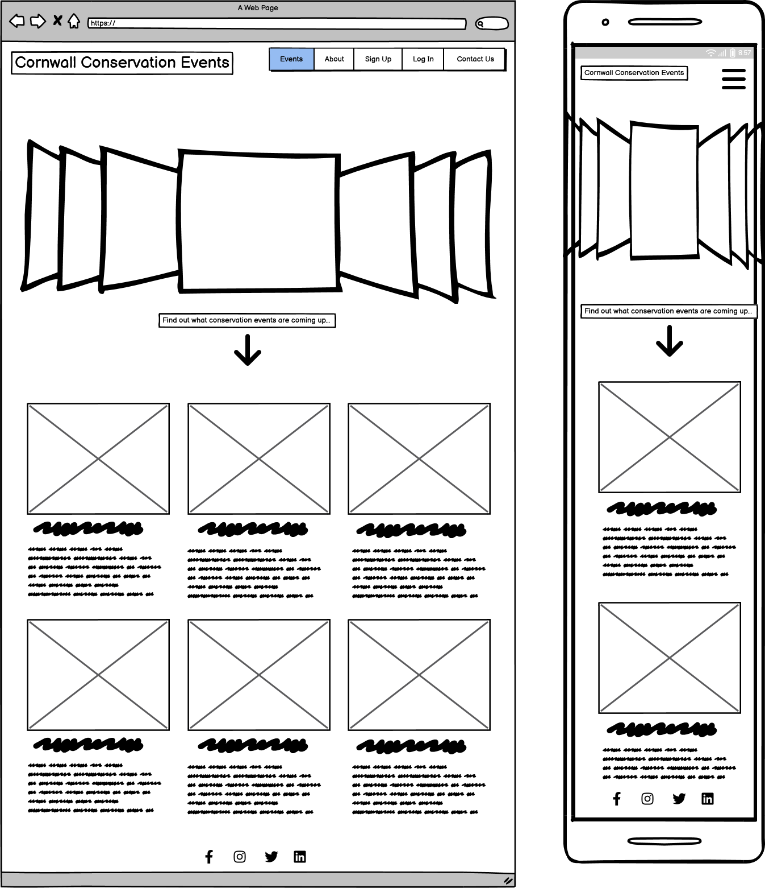

#### Event Page

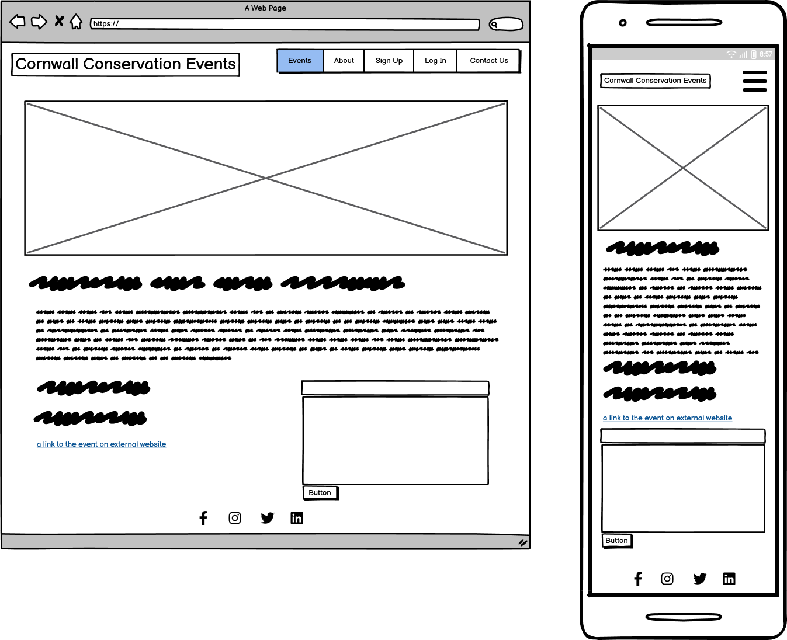

#### About Page

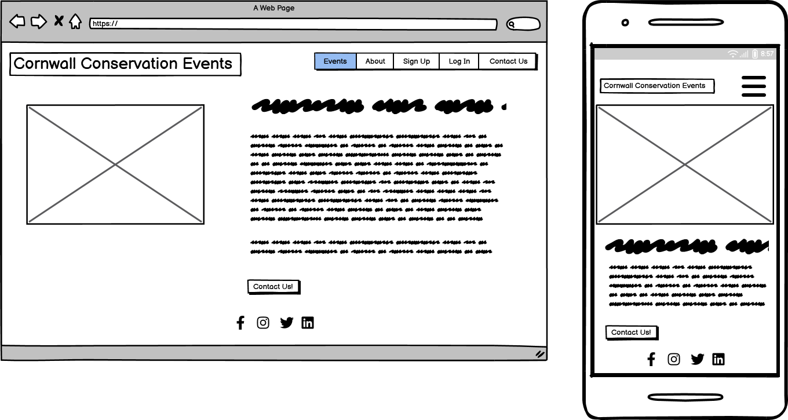

#### Contact Page

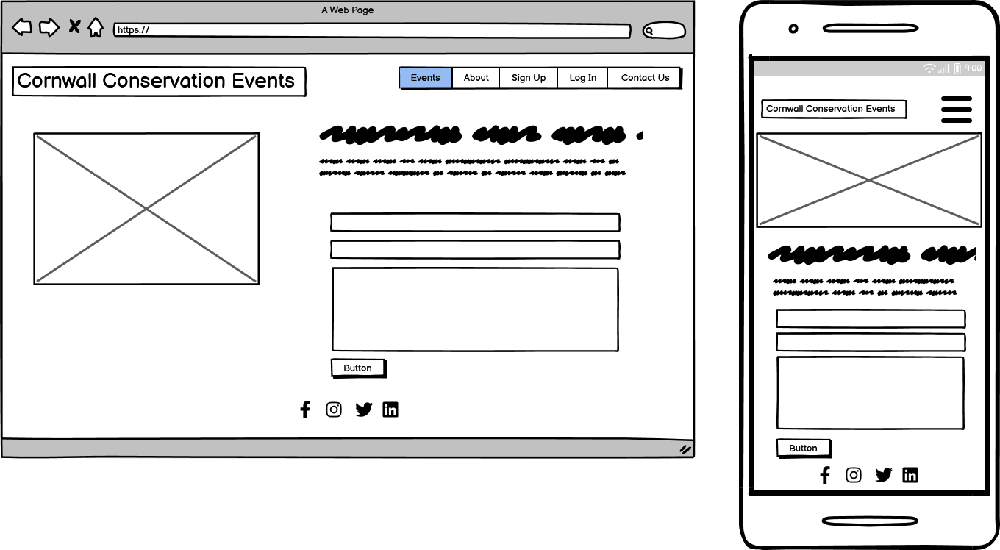

### ERD Diagram

## Features

### Existing Features

1. **Home Page** - The home page displays a list of events with pagination. The user can click on an event to view the full text.

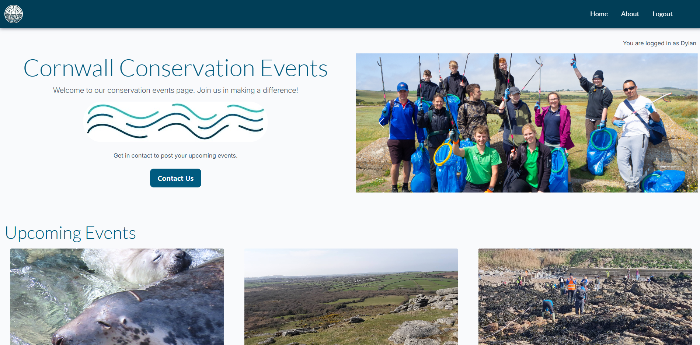

2. **Event Page** - The event page displays the full text of an event. The user can also view comments on the event. If logged in, the user can comment on the event. They can edit and delete their comments.

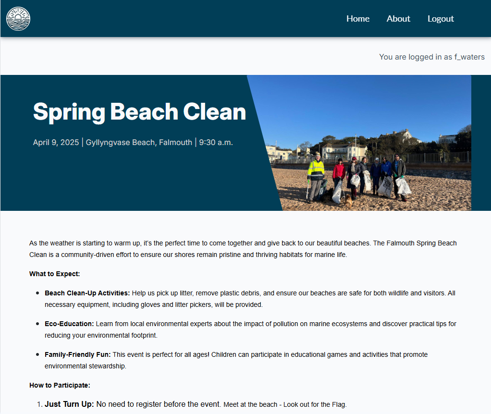

3. **About Page** - The about page displays information about the site. The user can also view a contact form.

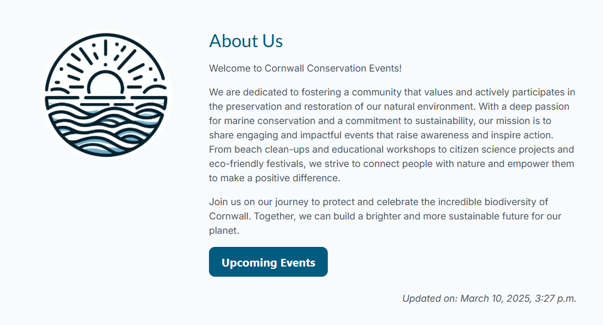

4. **Contact Form** - The about page displays a contact form.

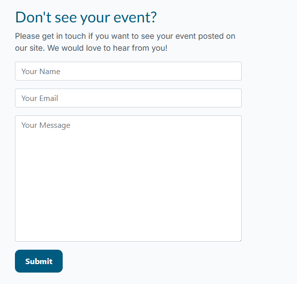

5. **Search Bar** - The search bar allows the user to search for events by tag.

6. **Navigation Bar** - The navigation bar allows the user to navigate the site pages and is provided via Bootstrap.

7. **Response Messages** - The user receives messages when they perform an action such as adding a comment.

8. **User Registration** - The user can register an account to comment on events.

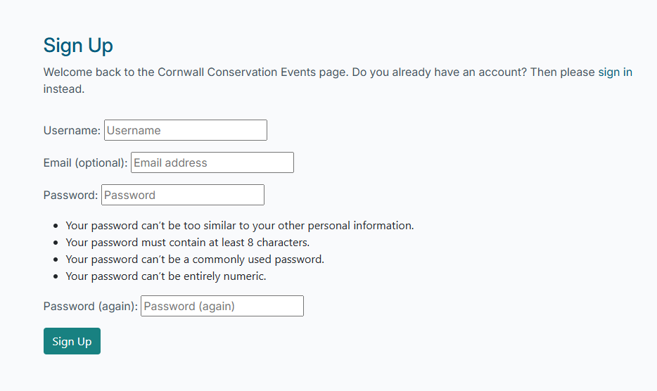

9. **User Login** - The user can log in to comment on events.

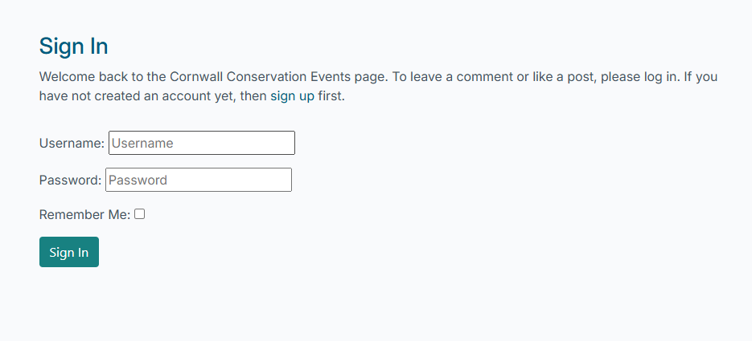

10. **User Logout** - The user can log out of their account.

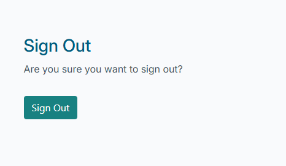

11. **Admin Features** - The admin can create, read, update and delete events. They can also approve or disapprove comments.

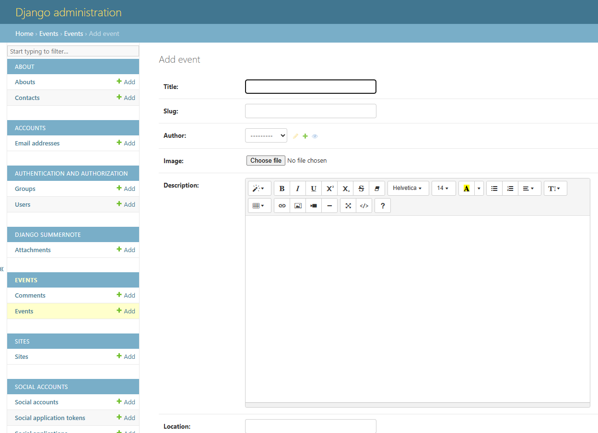

### Features Left to Implement

1. **User Profile** - The user can view their profile and update their details.

2. **User Password Reset** - The user can reset their password.

## Technologies Used

1. **HTML5** - The structure of the site was created using HTML5.
2. **CSS3** - The styling of the site was created using CSS3.
3. **JavaScript** - The site uses JavaScript for interactivity.
4. **Python** - The site uses Python for the backend.
5. **Django** - The site uses the Django web framework.
6. **Bootstrap** - The site uses the Bootstrap framework for styling.
7. **Font Awesome** - The site uses Font Awesome for icons.
8. **Google Fonts** - The site uses Google Fonts for typography.
9. **Heroku** - The site is deployed on Heroku.
10. **PostgreSQL** - The site uses a PostgreSQL database.
11. **Cloudinary** - The site uses Cloudinary for image hosting.

### How AI Was Used

Artificial Intelligence played a significant role in the development of this project. Here are some ways AI was utilised:

**Planning and Design**

AI tools like Copilot were used to generate ideas and suggestions for the project. These tools provided insights and recommendations for the website's layout, features, and functionality. This helped streamline the planning and design process and ensure a more user-friendly and engaging final product.

**Code Generation**

AI tools like GitHub Copilot were used to generate code snippets for various parts of the website. This included HTML structure and CSS styling. The AI provided context-aware suggestions that helped streamline the coding process and reduce development time.

**Debugging**

AI-powered debugging tools were utilised to identify and fix issues in the code. These tools analysed the codebase, detected potential bugs, and provided recommendations for resolving them. This ensured a smoother development process and a more robust final product.

**Accessibility Improvements**

AI was used to analyse the website's accessibility features. Tools like Lighthouse provided insights into how accessible the website is for users with disabilities and suggested improvements to enhance user experience.
By leveraging AI, the project was able to achieve a higher level of efficiency, creativity, and accessibility.

## Testing

The site was tested manually and using automated tests.

### Manual Testing

Manual testing was performed on the site to ensure that all features worked as expected. This included testing the following:
| Test | Expected Result | Actual Result |
|--- |--- |--- |
| Click Home menu | success | success |
| Click About menu | success | success |
| Click Resgister | success | success |
| Click Login | success | success |
| Click Logout | success | success |
| Click Contact Us button | success | success |
| Click Upcoming Events button | success | success |
| Click individual event post | success | success |
| Click back to event list | success | success |
| Create, edit, delete a personal comment | success | success |
| Register new account | success | success |
| Create contact request | success | success |
| Access admin interface | success | success |
| Responsivity | success | success |
| Open new page from social media links | success | success |

### Automated Testing

Automated tests were written using the Django test framework. These tests were run using the `python manage.py test` command and tested the following:

- The home page loads successfully.
- The event detail page loads successfully.
- The about page loads successfully.
- The comment form submits successfully.
- The contact form submits successfully.

## Deployment

The site was deployed to Heroku from the main branch of the repository early in the development stage for continuous deployment and checking.

The Heroku app is setup with 3 environment variables, repalcing the environment variables stored in env.py (which doesn't get pushed to github).

In order to create an Heroku app:

1.  Click on New in the Heroku dashboard, and Create new app from the menu dropdown.

2.  Give your new app a unique name, and choose a region, preferably one that is geographically closest to you.

3.  Click "Create app"

4.  In your app settings, click on "Reveal Config Vars" and add the environment variables for your app. These are:

        - DATABASE_URL - your database connection string
        - SECRET_Key - the secret key for your app
        - CLOUDINARY_URL - the cloudinary url for your image store

The PostgreSQL database is served from ElephantSQL

Once the app setup is complete, click on the Deploy tab and:

    1. Connect to the required GitHub account
    2. Select the repository to deploy from
    3. Click the Deploy Branch button to start the deployment.
    4. Once deployment finishes the app can be launched.

## Credits
This project is based on the "I Think Therefore I Blog" project from the LMS.

### Content

The content for the site was sourced from official event pages.

### Media

The images used on the site were hosted on Cloudinary and sourced from official event pages.
